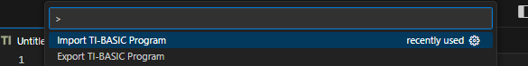
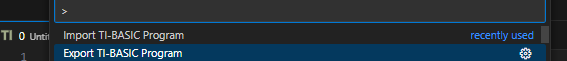

# TI-BASIC Language   

## About
This extension provides syntax highlighting, snippets (provided by [Hamburger317](https://github.com/Hamburger317)), and importing / exporting for the (e)Z80 TI-BASIC language (using an Emscripten build of [tivars_lib_cpp](https://github.com/adriweb/tivars_lib_cpp) courtesy of [Adriweb](https://github.com/adriweb/)). A big thank you to [nineteendo](https://github.com/nineteendo) as well for helping debug and correct a lot of the highlighting! This extension is meant specifically for the TI-84 Plus CE/83 Premium CE calculators, though it may work with others as well. Other useful features may be added in the future!

## FAQ
 * Q: Why can't I load my file in VSCode? 
   A: The files on the calculator are not normal text files, they are binary files consisting of tokens which are represented by text in the TI-BASIC editor. To open a file from the calculator, you need to import it first [(see below)](#importing).
 * Q: Why can't I send my file to the calculator? 
   A: For the same reason you can't load the calculator binaries into VS Code. If you wish to send the program, you'll first need to export it [(see below)](#exporting).

## Importing
To import a TI-BASIC program from your calculator, you'll first need to transfer it to your computer using software such as [TI-Connect CE](https://education.ti.com/en/products/computer-software/ti-connect-ce-sw) or [TiLP](http://lpg.ticalc.org/prj_tilp/). Now, create a new file in VS Code and press <kbd>ctrl</kbd> + <kbd>shift</kbd> + <kbd>P</kbd> to bring up the VS Code Command Palette. Search for and select "Import TI-BASIC Program":

This will bring up a window where you can select the program you wish to import, using your system file manager. Select a file, and you're good to go!

## Exporting
To export a TI-BASIC program to a file you can transfer to your calculator, first open the file in VS Code. Next, press <kbd>ctrl</kbd> + <kbd>shift</kbd> + <kbd>P</kbd> to bring up the VS Code Command Palette. Search for and select "Export TI-BASIC Program":

This will allow you to name and save the file. You can now use a program like [TI-Connect CE](https://education.ti.com/en/products/computer-software/ti-connect-ce-sw) or [TiLP](http://lpg.ticalc.org/prj_tilp/) to transfer the exported file to your calculator.

## Bugs
If you find a bug or want something added, be sure to [make an issue](https://github.com/TIny-Hacker/language-ti-basic/issues) and let me know!

© Copyright 2023 - 2026 TIny_Hacker
